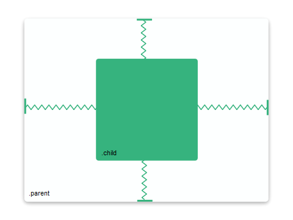
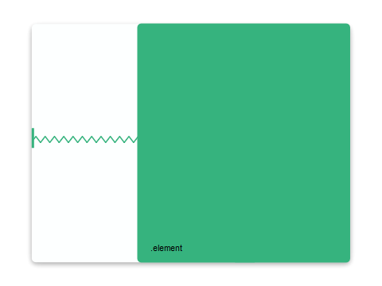

<h1 align="center" id="title">
    
</h1>

[![Build Status][ci-img]][ci]
[![Coverage][cov-img]][cov]
[![Maintainability][climate-img]][climate]
[![Dependencies][deps-img]][deps]
[![npm][npm-img]][npm]
[![Downloads][dwn-img]][npm]
[![Contributions Welcome][contrib-img]][contrib]

Rethinking CSS positioning with [PostCSS].

[PostCSS]:     https://github.com/postcss/postcss

[ci-img]:      https://travis-ci.org/matthias-t/postcss-positioning.svg
[ci]:          https://travis-ci.org/matthias-t/postcss-positioning

[cov-img]:     https://img.shields.io/codeclimate/coverage/github/matthias-t/postcss-positioning.svg
[cov]:         https://codeclimate.com/github/matthias-t/postcss-positioning

[climate-img]: https://img.shields.io/codeclimate/maintainability/matthias-t/postcss-positioning.svg
[climate]:     https://codeclimate.com/github/matthias-t/postcss-positioning

[deps-img]:    https://david-dm.org/matthias-t/postcss-positioning.svg
[deps]:        https://github.com/matthias-t/postcss-positioning/blob/master/package.json

[npm-img]: 	   https://img.shields.io/npm/v/postcss-positioning.svg
[dwn-img]:     https://img.shields.io/npm/dt/postcss-positioning.svg
[npm]:         https://npmjs.org/package/postcss-positioning

[contrib-img]: https://img.shields.io/badge/contributions-welcome-brightgreen.svg
[contrib]:     https://github.com/matthias-t/postcss-positioning/projects

[donate-img]:  https://img.shields.io/badge/donate-coffee-brightgreen.svg
[coffee]:      https://www.buymeacoffee.com/matthiast

[why-img]:     https://img.shields.io/badge/start%20with-why%3F-brightgreen.svg


## Why? ![Start With Why][why-img]

Positioning in CSS is painful.

Forget about `display`, `position`, `margin`, `padding`, absolute space, and all the complicated flexbox properties.

Now think about it as *spacing*. You have an element. It has a size. And you've got some space before, and some space after it. With postcss-positioning, all you need is two properties, `horizontal` and `vertical`.


## Examples

#### Center an element



```css
.child {
  horizontal: 1s 200px 1s;
  vertical: 1s 200px 1s;
}
```

#### Take up two thirds of the space on the right



```css
.element {
  horizontal: 1s 2s 0;
  vertical: 0 1s 0;
}
```

## How it works

```css
.element {
  horizontal: right width left;
  vertical: top height bottom;
}
```
The values specify *space before*, *size*, and *space after* on both axes. Remaining space is distributed between stretch lengths (ending with `s`). Read the [documentation](https://github.com/matthias-t/postcss-positioning/wiki/Documentation) to learn about elements with non-absolute positioning.

A CSS reset is performed by default, so user agents won't interfere with the positioning. See [options](https://github.com/matthias-t/postcss-positioning/wiki/Setup#2--options-1) if you want to disable it.

## Setup
If you are not familiar with PostCSS, head to the [wiki](https://github.com/matthias-t/postcss-positioning/wiki/Setup) for detailed instructions.
```bash
npm install --save-dev postcss-positioning postcss-calc
```
```js
module.exports = {
    plugins: [
        require('postcss-positioning')({ /* options */ }),
        require('postcss-calc')()
    ]
}
```

***

Part of this project is inspired by Kevin Lynagh's [talk][talk] at Deconstruct 2017.

[talk]: https://www.deconstructconf.com/2017/kevin-lynagh-choosing-features
